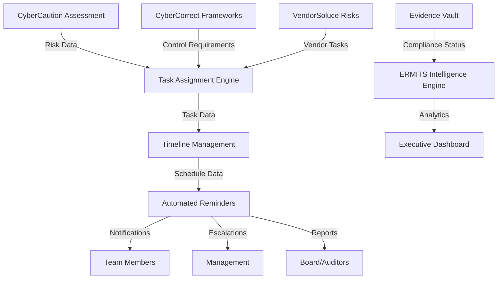

# CyberSoluce™ Orchestration & Tasking Module
## Technical Specifications & Implementation Guide

---

## 📋 **Module Overview**

**Purpose:** Manage compliance program execution through intelligent task orchestration, timeline management, evidence collection, and automated team coordination.

**Mission:** Transform compliance programs from reactive checkbox exercises into proactive, orchestrated initiatives that deliver measurable business value.

**Key Value Proposition:** 
- **85% reduction** in compliance project delays
- **Automated accountability** across distributed teams
- **Real-time visibility** into compliance program health
- **Evidence-driven compliance** with automated collection and validation

---

## 🏗️ **Architecture Overview**

```
┌─────────────────────────────────────────────────────────────┐
│                 CyberSoluce Command Center                 │
├─────────────────────────────────────────────────────────────┤
│                                                             │
│  ┌──────────────────┐  ┌──────────────────────────────────┐ │
│  │  Task Assignment │  │      Timeline & Milestones       │ │
│  │     Engine       │←→│         Management               │ │
│  └──────────────────┘  └──────────────────────────────────┘ │
│           ↕                            ↕                    │
│  ┌──────────────────┐  ┌──────────────────────────────────┐ │
│  │  Evidence Vault  │  │      Automated Reminders        │ │
│  │   & Repository   │←→│      & Notifications             │ │
│  └──────────────────┘  └──────────────────────────────────┘ │
│                                                             │
├─────────────────────────────────────────────────────────────┤
│               Integration Layer (ERMITS API)               │
└─────────────────────────────────────────────────────────────┘
```

---

## 🎯 **Component 1: Task Assignment Engine**

### **Purpose**
Intelligently distribute remediation and evidence collection tasks to appropriate team members based on skills, availability, workload, and organizational hierarchy.

### **Core Features**

#### **Intelligent Task Routing**
```javascript
// Smart Assignment Algorithm
const assignmentLogic = {
  criteria: {
    skillMatch: 0.4,        // 40% - Required expertise
    workloadBalance: 0.3,   // 30% - Current capacity
    previousPerformance: 0.2, // 20% - Historical success rate
    organizationalRole: 0.1   // 10% - Authority level
  },
  
  autoAssignment: {
    technical: "SecurityEngineers",
    compliance: "ComplianceOfficers", 
    documentation: "TechnicalWriters",
    review: "Managers"
  }
}
```

#### **Task Categories & Templates**
1. **Evidence Collection Tasks**
   - Document gathering and verification
   - System configuration reviews
   - Policy implementation validation
   - Control testing execution

2. **Remediation Tasks**
   - Security control implementation
   - Policy updates and approvals
   - System configuration changes
   - Training completion requirements

3. **Review & Approval Tasks**
   - Management sign-offs
   - Technical validation reviews
   - Audit preparation activities
   - Stakeholder communications

### **Technical Specifications**

#### **Database Schema**
```sql
-- Tasks Table
CREATE TABLE tasks (
    id UUID PRIMARY KEY,
    title VARCHAR(255) NOT NULL,
    description TEXT,
    task_type ENUM('evidence', 'remediation', 'review') NOT NULL,
    framework VARCHAR(50), -- NIST, ISO, CMMC, etc.
    control_id VARCHAR(100),
    priority ENUM('critical', 'high', 'medium', 'low') DEFAULT 'medium',
    estimated_hours INTEGER,
    assigned_to UUID REFERENCES users(id),
    assigned_by UUID REFERENCES users(id),
    status ENUM('draft', 'assigned', 'in_progress', 'review', 'completed', 'blocked') DEFAULT 'draft',
    due_date TIMESTAMP,
    created_at TIMESTAMP DEFAULT CURRENT_TIMESTAMP,
    updated_at TIMESTAMP DEFAULT CURRENT_TIMESTAMP,
    metadata JSONB -- Custom fields per organization
);

-- Task Dependencies
CREATE TABLE task_dependencies (
    id UUID PRIMARY KEY,
    parent_task_id UUID REFERENCES tasks(id),
    dependent_task_id UUID REFERENCES tasks(id),
    dependency_type ENUM('blocks', 'triggers', 'informs') NOT NULL,
    created_at TIMESTAMP DEFAULT CURRENT_TIMESTAMP
);

-- Task Comments & Updates
CREATE TABLE task_updates (
    id UUID PRIMARY KEY,
    task_id UUID REFERENCES tasks(id),
    user_id UUID REFERENCES users(id),
    update_type ENUM('comment', 'status_change', 'assignment', 'attachment') NOT NULL,
    content TEXT,
    old_value VARCHAR(255),
    new_value VARCHAR(255),
    created_at TIMESTAMP DEFAULT CURRENT_TIMESTAMP
);
```

#### **API Endpoints**
```typescript
// Task Assignment API
interface TaskAssignmentAPI {
  // Create new task
  POST /api/tasks: {
    body: CreateTaskRequest,
    response: Task
  }
  
  // Smart assignment suggestion
  POST /api/tasks/{id}/suggest-assignee: {
    response: AssignmentSuggestion[]
  }
  
  // Bulk task creation from assessment
  POST /api/tasks/bulk-create: {
    body: BulkTaskRequest,
    response: Task[]
  }
  
  // Task reassignment
  PUT /api/tasks/{id}/assign: {
    body: AssignmentRequest,
    response: Task
  }
}
```

---

## 📅 **Component 2: Timeline & Milestones Management**

### **Purpose**
Provide comprehensive project timeline visualization with dependency management, critical path analysis, and milestone tracking for compliance initiatives.

### **Core Features**

#### **Dynamic Timeline Generation**
- **Auto-generated timelines** based on framework requirements
- **Critical path calculation** for optimization
- **Dependency mapping** with conflict detection
- **Resource leveling** to prevent overallocation

#### **Milestone Categories**
1. **Framework Milestones**
   - Assessment completion checkpoints
   - Control implementation deadlines
   - Documentation review gates
   - Audit preparation milestones

2. **Business Milestones**
   - Executive review meetings
   - Budget approval gates
   - Vendor deliverable deadlines
   - Training completion targets

3. **Risk Milestones**
   - Vulnerability remediation deadlines
   - Incident response plan tests
   - Business continuity drills
   - Security awareness campaigns

### **Gantt Chart Implementation**
```typescript
interface TimelineConfig {
  views: {
    daily: boolean,
    weekly: boolean,
    monthly: boolean,
    quarterly: boolean
  },
  
  criticalPath: {
    enabled: boolean,
    highlightColor: string,
    bufferDays: number
  },
  
  dependencies: {
    finishToStart: string, // Most common
    startToStart: string,
    finishToFinish: string,
    startToFinish: string
  },
  
  milestones: {
    shapes: 'diamond' | 'circle' | 'square',
    colors: MilestoneColorMap
  }
}
```

### **Timeline Intelligence Features**
- **Predictive delays** using ML analysis of historical data
- **Resource conflict detection** with auto-resolution suggestions
- **Weather-aware scheduling** for external dependencies
- **Holiday and PTO integration** for realistic planning

---

## 🗄️ **Component 3: Evidence Vault**

### **Purpose**
Secure, organized, and audit-ready repository for compliance evidence with automated collection, validation, and retention management.

### **Core Features**

#### **Evidence Categories**
1. **Technical Evidence**
   - System configurations
   - Security tool outputs
   - Vulnerability scan results
   - Penetration test reports

2. **Administrative Evidence**
   - Policies and procedures
   - Training records
   - Meeting minutes
   - Management approvals

3. **Continuous Evidence**
   - Log files and monitoring data
   - Automated control validations
   - Real-time compliance metrics
   - Ongoing assessment results

#### **Automated Collection Framework**
```python
class EvidenceCollector:
    def __init__(self):
        self.collectors = {
            'system_configs': SystemConfigCollector(),
            'security_logs': LogCollector(),
            'training_records': TrainingCollector(),
            'policy_docs': DocumentCollector()
        }
    
    def collect_evidence(self, control_id: str, evidence_type: str):
        """Automatically collect and validate evidence for specific control"""
        collector = self.collectors.get(evidence_type)
        if collector:
            evidence = collector.collect(control_id)
            validation_result = self.validate_evidence(evidence)
            return self.store_evidence(evidence, validation_result)
```

#### **Evidence Storage Architecture**
```sql
-- Evidence Repository
CREATE TABLE evidence_items (
    id UUID PRIMARY KEY,
    control_id VARCHAR(100) NOT NULL,
    framework VARCHAR(50) NOT NULL,
    evidence_type ENUM('document', 'screenshot', 'report', 'log', 'configuration') NOT NULL,
    title VARCHAR(255) NOT NULL,
    description TEXT,
    file_path VARCHAR(500),
    file_hash VARCHAR(64), -- SHA-256 for integrity
    collected_by ENUM('manual', 'automated') DEFAULT 'manual',
    collection_date TIMESTAMP DEFAULT CURRENT_TIMESTAMP,
    validity_period INTEGER, -- Days valid
    expires_at TIMESTAMP,
    validation_status ENUM('pending', 'valid', 'invalid', 'expired') DEFAULT 'pending',
    retention_policy VARCHAR(100),
    tags JSONB,
    metadata JSONB
);

-- Evidence Validation History
CREATE TABLE evidence_validations (
    id UUID PRIMARY KEY,
    evidence_id UUID REFERENCES evidence_items(id),
    validator_id UUID REFERENCES users(id),
    validation_date TIMESTAMP DEFAULT CURRENT_TIMESTAMP,
    status ENUM('approved', 'rejected', 'needs_revision') NOT NULL,
    comments TEXT,
    validation_criteria JSONB
);
```

#### **Chain of Custody Features**
- **Digital signatures** for evidence integrity
- **Audit trail logging** for all access and modifications
- **Version control** for document evidence
- **Automated backup** and disaster recovery

---

## 🔔 **Component 4: Automated Reminders & Notifications**

### **Purpose**
Proactive communication system ensuring no compliance deadlines are missed and all stakeholders stay informed of progress and issues.

### **Core Features**

#### **Smart Notification Engine**
```typescript
interface NotificationRules {
  triggers: {
    taskDue: {
      advance: [7, 3, 1], // Days before due date
      escalation: [1, 7, 14] // Days after due date
    },
    milestoneApproaching: {
      advance: [14, 7, 3, 1]
    },
    evidenceExpiring: {
      advance: [30, 14, 7, 3]
    },
    complianceGap: {
      immediate: true,
      escalation: [1, 3, 7]
    }
  },
  
  channels: {
    email: NotificationConfig,
    slack: SlackConfig,
    teams: TeamsConfig,
    sms: SMSConfig,
    inApp: InAppConfig
  },
  
  personalization: {
    byRole: RoleBasedRules,
    byPreference: UserPreferences,
    byUrgency: UrgencyRules
  }
}
```

#### **Notification Categories**

1. **Task Notifications**
   - Assignment confirmations
   - Due date reminders
   - Status change updates
   - Dependency alerts

2. **Milestone Notifications**
   - Upcoming deadline warnings
   - Completion celebrations
   - Delay notifications
   - Resource requirement alerts

3. **Evidence Notifications**
   - Collection reminders
   - Expiration warnings
   - Validation requests
   - Archive confirmations

4. **Escalation Notifications**
   - Overdue task alerts
   - Manager escalations
   - Executive summaries
   - Board-level reporting

#### **Multi-Channel Delivery**
```python
class NotificationDispatcher:
    def __init__(self):
        self.channels = {
            'email': EmailChannel(),
            'slack': SlackChannel(),
            'teams': TeamsChannel(),
            'sms': SMSChannel(),
            'webhook': WebhookChannel()
        }
    
    def send_notification(self, notification: Notification):
        """Send notification through appropriate channels based on urgency and preferences"""
        for channel_name in notification.channels:
            channel = self.channels.get(channel_name)
            if channel and channel.is_available():
                channel.send(notification)
```

---

## 🔗 **ERMITS Ecosystem Integration**

### **Data Flow Integration**


### **API Integration Points**
```typescript
// ERMITS Ecosystem APIs
interface ERMITSIntegration {
  // Pull assessment results for task generation
  assessmentAPI: {
    getLatestAssessment(organizationId: string): Assessment,
    getGapAnalysis(frameworkId: string): GapAnalysis
  },
  
  // Push task completion for compliance scoring
  complianceAPI: {
    updateControlStatus(controlId: string, status: ControlStatus): void,
    submitEvidence(controlId: string, evidence: Evidence[]): void
  },
  
  // Risk scoring integration
  riskAPI: {
    updateRiskMetrics(taskCompletion: TaskMetrics): void,
    getThreatIntelligence(assetId: string): ThreatData
  }
}
```

---

## 📊 **Success Metrics & KPIs**

### **Operational Metrics**
- **Task Completion Rate**: Target 95% on-time completion
- **Average Task Resolution Time**: Track by complexity and type
- **Evidence Collection Efficiency**: Automated vs. manual collection ratios
- **Notification Effectiveness**: Response rates by channel and urgency

### **Business Impact Metrics**
- **Compliance Program Velocity**: Time from gap identification to closure
- **Audit Preparation Time**: Reduction in hours needed for audit readiness
- **Compliance Cost Per Control**: Total cost divided by number of active controls
- **Risk Mitigation Speed**: Time from identification to remediation

### **User Experience Metrics**
- **Task Assignment Accuracy**: Percentage of tasks assigned to optimal resources
- **User Satisfaction Scores**: Regular surveys of task assignees and managers
- **Notification Relevance**: Percentage of notifications marked as useful
- **System Adoption Rate**: Active users vs. total licensed users

---

## 🚀 **Implementation Roadmap**

### **Phase 1: Foundation (Weeks 1-4)**
- [ ] Core database schema implementation
- [ ] Basic task assignment engine
- [ ] Simple timeline visualization
- [ ] Email notification system

### **Phase 2: Intelligence (Weeks 5-8)**
- [ ] Smart assignment algorithms
- [ ] Dependency management
- [ ] Evidence vault core features
- [ ] Multi-channel notifications

### **Phase 3: Integration (Weeks 9-12)**
- [ ] ERMITS ecosystem API integration
- [ ] Advanced timeline features (Gantt charts)
- [ ] Automated evidence collection
- [ ] Mobile app notifications

### **Phase 4: Optimization (Weeks 13-16)**
- [ ] Machine learning for task optimization
- [ ] Predictive analytics for delays
- [ ] Advanced reporting and dashboards
- [ ] Full audit trail capabilities

---

## 🔒 **Security & Compliance**

### **Data Protection**
- **Encryption at rest** using AES-256
- **Encryption in transit** using TLS 1.3
- **Role-based access control** with principle of least privilege
- **Audit logging** for all system interactions

### **Compliance Standards**
- **SOC 2 Type II** controls implementation
- **GDPR compliance** for EU data subjects
- **CCPA compliance** for California residents
- **HIPAA compliance** for healthcare evidence

### **Evidence Integrity**
- **Digital signatures** for critical evidence
- **Blockchain timestamping** for immutable audit trails
- **Multi-factor authentication** for sensitive operations
- **Regular security assessments** and penetration testing

---

This comprehensive specification provides the foundation for implementing the Orchestration & Tasking module as a core component of the CyberSoluce governance command center, ensuring seamless integration with the broader ERMITS ecosystem while delivering measurable business value through intelligent automation and orchestration.